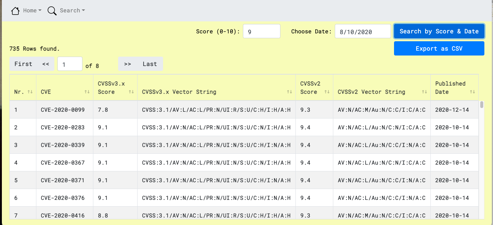
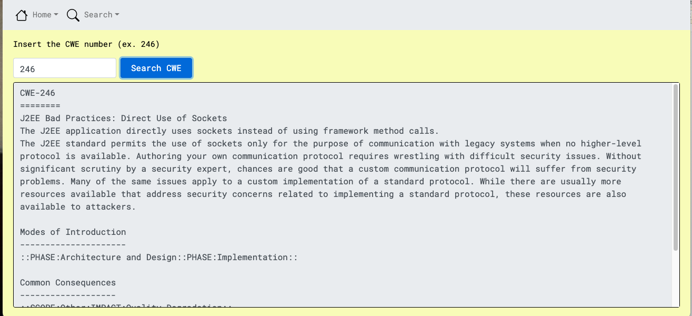

# CVEWebManager
**CVEWebManager** is a Web application for searching CVE, CPE or CWE
from NIST.

The idea is based on the command line tool cvemanager from Antonios
Atlasis (<https://github.com/aatlasis/cve_manager>).

After setting up postgres database using
[cve_manager](https://github.com/aatlasis/cve_manager) the Web
application provides a handy environment to search and get info for:

-   Specific CVE number

-   CVE number greater than a certain score value

-   CVE number greater than a certain score value, and newer from a
    certain date

-   CPE that is also greater than a certain score value

-   CPE that is also greater than a certain score value, and newer from
    a certain date

-   Specific CWE number

You can also save your result as a csv file

Full PDF document will be provided soon with detailed information.

Some screenshots:

